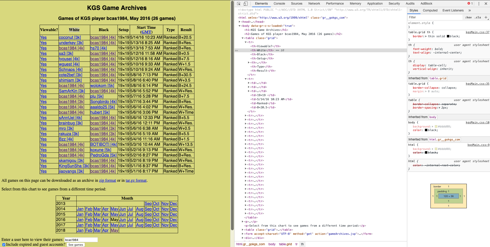
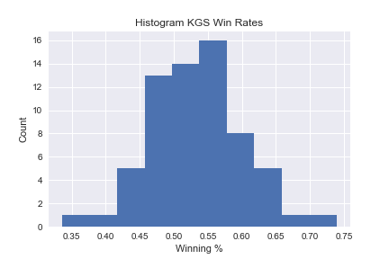
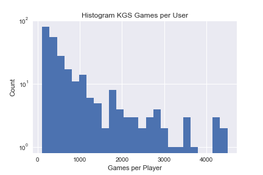
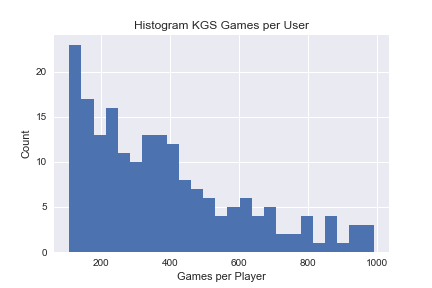

# Analysis of Students from the American and European Yunguseng Dojangs

## Background
The Yungseng Dojang--comprising an American and European school--is an
online go school run by In-seong Hwang. He is a very strong amatuer go player
from South Korea currently living in France.

I was a member of the American Yunguseng Dojang in Spring 2015 and Winter
2016. I really enjoyed the program, and my skill at the game of go increased
quite a bit during the time of my enrollment.

Since I was familiar with the YD websites, I knew that there was quite a
bit of information available about student performance while at the school.
Further, I knew that every student in the school has an account on the KGS
Go Server. The archives of this server are public. So, I had access to
quite a few game records for each student.

With all of this data available, this seemed like an excellent topic for
analysis.

## Web-scraping
The first step in most projects is gathering the data. This project is not an exception.

There were two relevant sources of data for this project. I'll discuss each in turn below.

### Scraping the EYD Website
Here is an image of my profile page on the EYD Website.

I found that every student--whether AYD or EYD--has a profile page associated with
an URL with this format "https://eyd.yunguseng.com/season24/profile.php?id=" where
the id is a number ranging from 1 to approximately 850. So, I was able to generate
every URL and proceed directly to the page without much searching.

As you can see, there is a lot of data here to be extracted. I'll talk about
cleaning the data shortly. For now, let's just note the relevant data here:
1. Name
2. KGS Username
3. Game Records

At this point, I created a Mongo Database and inserted the html of each page for
processing at a later time.

### Scraping the KGS Archive
The KGS Archive proved to be a more challenging problem for two reasons:
1. The relevant information was spread across several webpages per user.
2. The volume of data.

Here's an image of one month of my games from the archive.

You'll notice that there are two tables here. The first
contains the data about the games I played in May 2016.
The second contains the URLs to other dates. Unfortunately,
there is now way to tell whether the user played any games
in a month before accessing that page. This means that we're
going to dedicate a lot of time to accessing pages with no
useful information.

Because of the sheer number of pages, it wasn't feasible for
me to perform the scraping locally. So, I utilized Amazon Web
Services EC2 units to accomplish this task. I created an image
with the required dependencies and an up to date copy of this
repository. I used this image to spin up five EC2s and devoted
each instance to scraping the archive, each targeting a different
set of users.

### Results
I recorded the html of 850 pages on the EYD website and
about 20,000 pages from the KGS Archives as of May 31, 2019.

## Data Cleaning
Although I still do not have the complete set of data from the KGS
Archive, I have developed the pipelines to clean and organize the
information I've gathered from both sources into usable data.

### PostgreSQL and SQLAlchemy

### Cleaning YD Data
The following function is used to clean the data displayed
on a YD Member page.

### Cleaning KGS Data

The following function is used to clean the data displayed
on the KGS Archives.

## Descriptive Statistics

### YD Data

#### Number of Students

#### Win Rate By Student

### Games Played on KGS

## Hypothesis Testing

## For the Future (as of May 31, 2019)

### Flask Application

### Scheduled Scraping for New Data

### Deployment

## Post-Mortem (as of May 31, 2019)

### What went well?
1. Version control.
2. Use of MongoDB and Postgres.
3. Pandas during data cleaning.
4. Reasonable implementation of the 

### What could be improved?
1. Better utilization of cloud computing.
2. Utilization of descriptive statistics.
3. Better use of existing libraries.
4. Better testing procedures and workflow.

### How to improve for next time?

